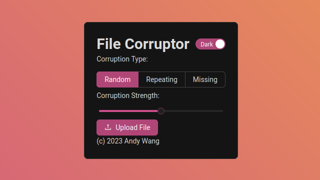

# File Corruptor 📁🗑️
This is a simple react + express app to corrupt files using 3 different methods.

## Prerequisites
- [NodeJS](https://nodejs.org)
- [Yarn](https://yarnpkg.com/)
- [Git](https://git-scm.com/)

## Dependencies
### Frontend

- [@ant-design/icons](https://www.npmjs.com/package/@ant-design/icons) ^5.0.1
- [antd](https://www.npmjs.com/package/antd) ^5.4.2
- [react](https://www.npmjs.com/package/react) ^18.2.0
- [react-dom](https://www.npmjs.com/package/react-dom) ^18.2.0

### Backend
- [cors](https://www.npmjs.com/package/cors) ^2.8.5
- [express](https://www.npmjs.com/package/express) ^4.18.2
- [multer](https://www.npmjs.com/package/multer) ^1.4.5-lts.1

## Installation
1. Clone the repo:
```bash
git clone https://github.com/flandolf/file-corruptor.git
```
2. Install dependencies:
```bash
yarn
```
## Usage
1. Run the backend (local server at http://localhost:3000)
    ```bash
    node ./backend/server.js
    ```
2. Run the frontend
    ```bash
    cd frontend
    ```
    ```bash
    yarn dev
    ```
3. Point browser to the vite server and enjoy!

## Tests
Tests are avaliable for the backend, to run:
```bash
yarn test
```

## Build

To build the app, simply run 
```bash
cd frontend
```
```bash
yarn build
```

## License
This project is licensed under the [MIT License](LICENSE) for more details, visit the [LICENSE](LICENSE) file.